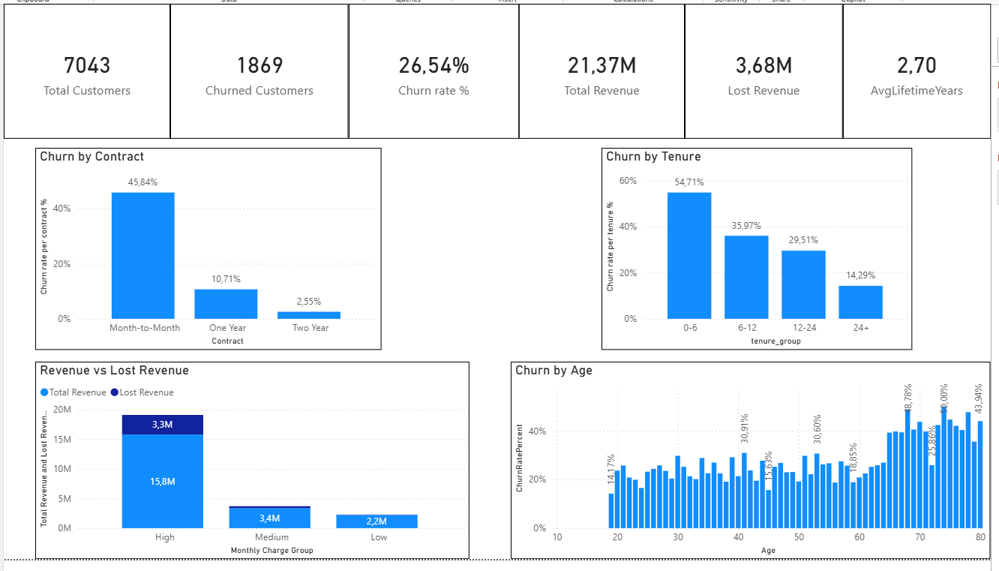
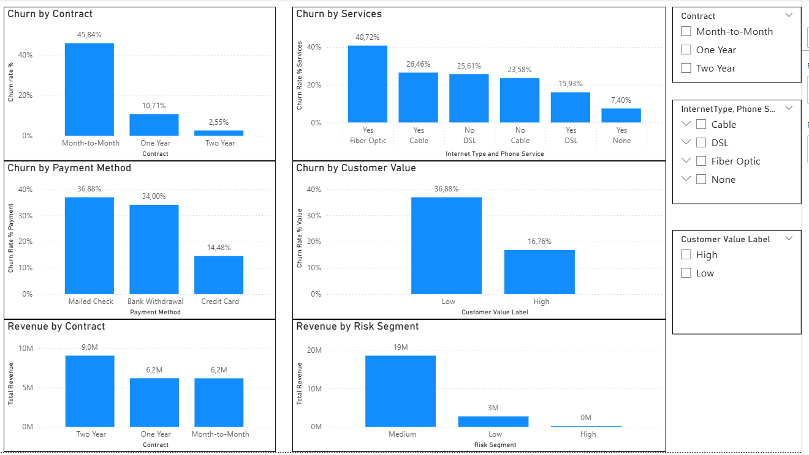
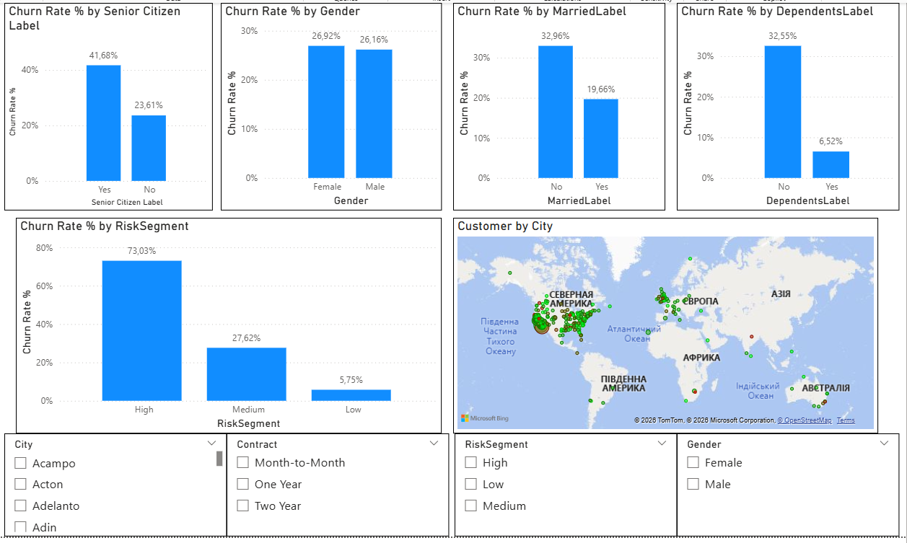
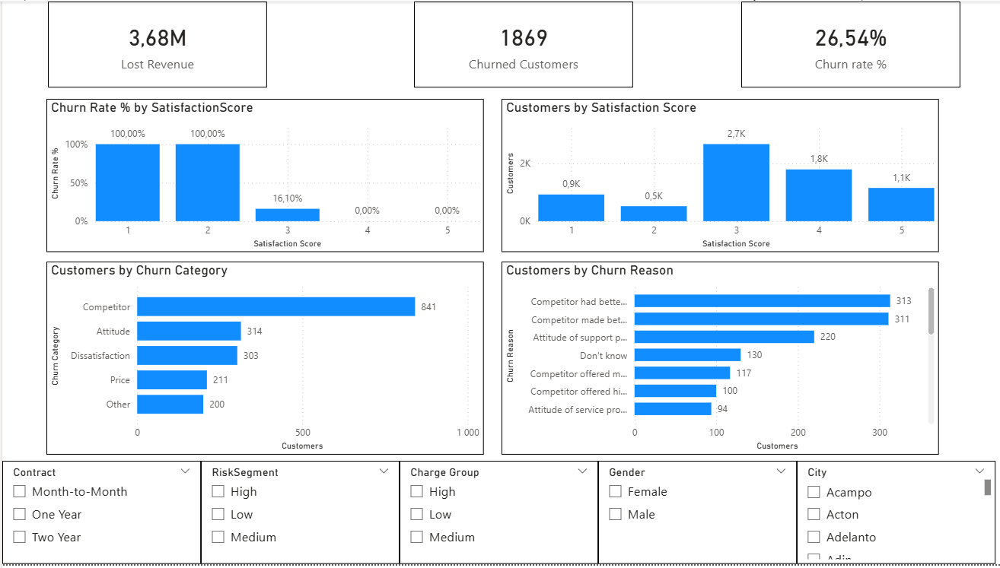
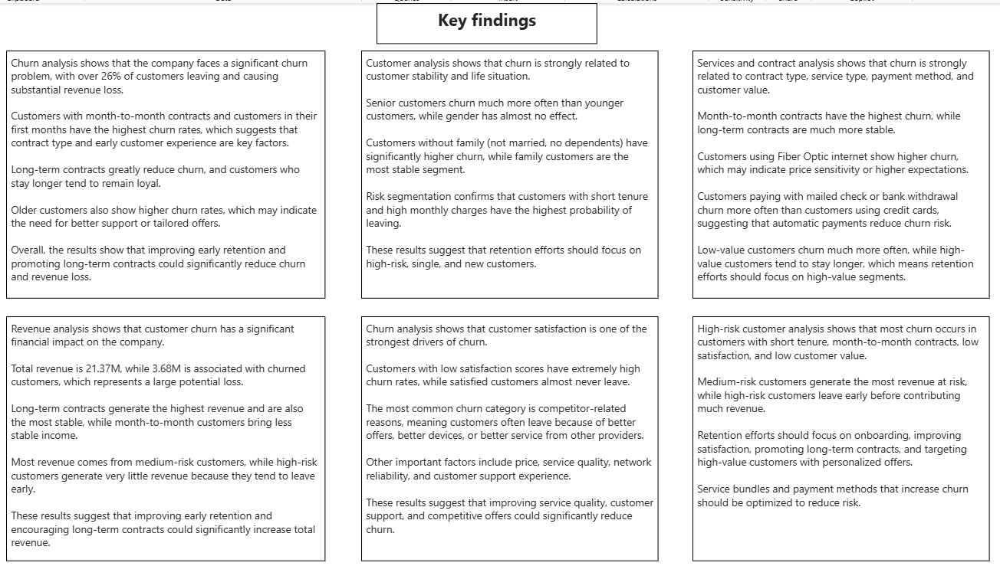
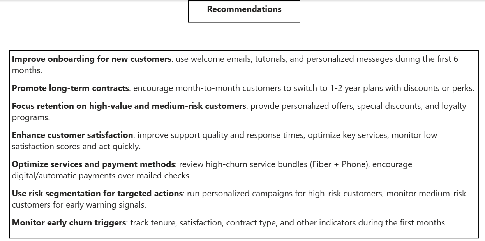

# Telco Churn Analysis Dashboard

## Project Description

This project analyzes customer churn for a telecommunications company, identifying high-risk customers, understanding churn drivers, and evaluating the impact on revenue. The analysis combines data modeling and Power BI dashboards to provide actionable business insights.  

The main goal is to help the company reduce churn, increase customer retention, and protect revenue.

---

## Dataset

The dataset contains information on:

- Customer demographics (age, gender, marital status, dependents, seniority)
- Tenure, contract type, and payment method
- Services subscribed (phone, internet type, etc.)
- Revenue and monthly charges
- Satisfaction scores
- Churn labels, categories, and reasons

Source: internal telco data (preprocessed for analysis)

---

## Goals

1. Assess the severity of churn.  
2. Identify which customers churn most frequently.  
3. Determine which products or services are linked to high churn.  
4. Analyze the impact of churn on revenue.  
5. Identify the key factors driving churn.  
6. Determine high-risk customers and recommend actions to reduce churn.

---

## Key Metrics / KPIs

- **Total Customers**: 7,044  
- **Churned Customers**: 1,869 (26.54%)  
- **Lost Revenue**: 3.68M  
- **Average Customer Lifetime**: varies by tenure segment  
- **Churn by Contract**: Month-to-month 45.84%, One year 10.71%, Two year 2.55%  
- **Churn by Risk Segment**: High 73.03%, Medium 27.62%, Low 5.75%  

---

## Insights

### 1. How serious is churn?

- Significant revenue is lost due to churn (3.68M out of 21.37M).  
- Most churn occurs in short-tenure and month-to-month contract customers.  
- Older customers and those without dependents or partners have higher churn rates.

### 2. Which customers churn most?

- Senior customers: 41.68% churn  
- Customers without family: 32–33% churn  
- Risk segmentation: high-risk 73%, medium-risk 27.6%, low-risk 5.75%  

### 3. Products or services linked to high churn

- Month-to-month contracts: 45.84% churn  
- Services: Fiber + phone 40.72%, Cable + phone 26.46%  
- Payment method: Mailed check 36.88%  

### 4. Churn impact on revenue

- Long-term contracts generate most revenue (Two year = 9M)  
- Medium-risk segment accounts for most revenue at risk (19M)  
- High-risk customers leave early, contributing little revenue  

### 5. Churn drivers

- Low satisfaction (score 1–2) → 100% churn  
- Competitor offers, service attitude, pricing, and network reliability are key reasons for churn  

### 6. High-risk customers and actions

- Early tenure, month-to-month contracts, low satisfaction, low customer value → highest churn  
- Medium-risk customers → highest revenue at risk  
- Recommended actions: onboarding programs, long-term contracts, personalized retention campaigns, service and payment optimization  

---

## Recommendations

- **Improve onboarding for new customers**: welcome emails, tutorials, personalized messages in the first 6 months.  
- **Promote long-term contracts**: switch month-to-month customers to 1–2 year plans with perks.  
- **Focus retention on high-value and medium-risk customers**: personalized offers, loyalty programs.  
- **Enhance customer satisfaction**: improve support quality, monitor low satisfaction scores, optimize services.  
- **Optimize services and payment methods**: review high-churn bundles, encourage digital payments.  
- **Use risk segmentation for targeted actions**: run campaigns for high-risk customers, monitor medium-risk for early warning signals.  
- **Monitor early churn triggers**: track tenure, satisfaction, and contract type in the first months.

---

## Power BI Dashboard

The dashboard consists of **4 main pages** and **2 text pages**:

1. **Overview** – Key KPIs, overall churn trends, total customers lost, and revenue impact
2. **Contract & Services** – Churn by contract type, subscribed services, and payment methods
3. **Demographics & Risk Segment** – Churn patterns by age, gender, marital status, dependents, tenure, and risk segments
4. **Retention & Churn Drivers** – How customer satisfaction, tenure, and service usage influence churn 
5. **Insights** – Summary of key findings, patterns, and risk segments
6. **Recommendations** – Actionable strategies to reduce churn and retain high-value customers 

Each page includes interactive slicers for demographics, contract, services, and risk segment.

---

## Screenshots

### Overview Page

### Contract & Services Page

### Demographics & Risk Segment

### Retention & Churn Drivers

### Insights

### Recommendations

---

## Author

Martyn Kovalchuk

Portfolio project for Data / Product Analyst position
